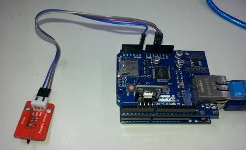
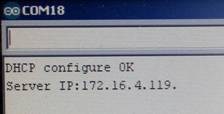
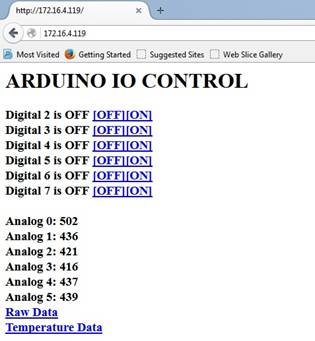

# Arduino Ethernet IO Controller

Here’s a little project that isn’t hard to build, but really  has unlimited uses. Here, the Arduino uses an Ethernet Shield to serve up web  pages with info about the current state of the IO pins, and when a user clicks  on a link on the web page, they can change the digital outputs. Sounds simple,  but it means that you can control simple devices from any browser which can  connect to the Ethernet Shield.

Thanks to the company VPN, someone 1000km away is currently  making lights flash on my desk, and he can see what temperature it is on my desk. But you could also make it  externally accessible by changing the port forwarding settings on your router  (be careful though- there’s no password, so pretty much anyone can access the  Arduino then).

What’s it good for? Turn on the lights in another room  (relay module). See if someone has left the fridge door open (analog light or  temperature sensor).  See if it’s raining  (go outside, or use a rain sensor module). Pretty much anything you can control  with a digital on-off output, or read with a 0-5V analog input can be connected  to this project.

## Components

|Qty| Code | Description |
|---|---|---|
|1 | [XC4410](http://jaycar.com.au/p/XC4410) | uno main board
|1 | [XC4412](http://jaycar.com.au/p/XC4412) | Ethernet shield


You may need some of the following items:

[XC4428 RGB LED module](https://jaycar.com.au/p/XC4428)
- an easy way to test if the digital outputs are working

[XC4538 Analog Temperature Sensor Module](https://jaycar.com.au/p/XC4538)
- to test analog inputs

[YN8205 10m Ethernet Cable](https://jaycar.com.au/p/YN8205)
- to connect to your router

## Assembly

There’s not much assembly needed, to get the basic sketch working, just plug the Ethernet Shield into the top of the Uno, and attach a  USB and Ethernet cable. The below picture shows the LED Module plugged straight  into D4-D7, and the Temperature Sensor Module plugged into GND, 5V and A0.



## Operation

Once the sketch has been successfully uploaded to the Uno,  plug in the Ethernet cable, then open the Serial Monitor at 115200 baud. This  will print out the IP address that the Controller has been given. If no IP  address is given, check that DHCP is active on your router and that MAC address  blocking is not blocking the Controller. The MAC address of the Controller is  specified in the sketch and can be changed if there is a conflict. If you are  looking to run more than one of these on the same network, this will definitely  need to be changed. To keep the IP address the same, use the IP address  reservation feature of the router.



Now open a browser on the network, and type the IP address  into the address bar (ignore the last .):



This is the page you should get. You can control the digital  outputs by clicking the [OFF] and [ON] links at the top. Digital 4, 5 and 6  should make the LED light up. The default analog display is raw data, but  clicking on ‘Temperature Data’ will show the inputs converted to degrees.

## Improvements

Of course the obvious thing to do is add some more  interesting input and output devices, most of which could be as simple as  plugging in a different Arduino module.

You could do a lot more interesting things by changing the  sketch. Notice how the Arduino uses query parameters to change the outputs:

```
http://172.16.4.119/?21
```

activates this line:   `if(parms=="21"){outs[0]=1;}`

So you can add extra commands by adding extra `if`  statements here. For example:

```c
if(parms=="debug"){
  Serial.println("Debug");
}
```
will print *Debug* on the serial monitor if the page `http://172.16.4.119/?debug`
is accessed.

At the moment though, these commands will be hidden, because  there isn’t a link for them.

To add a link to the page that is served up, you need to add  the following to the section that ‘prints’ out the web page to the browser:

```c
  client.print("<a href=\"");
  client.print(fname);
  client.print("?debug\">debug</a><br>");
```

Note that the first `debug` is the name of the command used  in the `if` statement above, while the second `debug` is what appears as the  link on the screen.
Of course you could add a library which reads a non-analog  sensor (eg a digital humidity sensor) and display it to the web page as well-  or even get the Arduino to process the sensor inputs and automatically control  the outputs, as well as allowing remote control from the web interface.

Another option could be to use an Arduino as a web client  (eg Files>Examples>Ethernet>WebClient), and get it to trigger the  commands and read back the data. That gives the option of manual or automatic  control.

We’re looking at getting a Wifi shield soon, so look out for  a Wifi version of this project too.

This is a useful link if you want to understand the HTML  generated by the Arduino:

[http://www.simplehtmlguide.com/cheatsheet.php](http://www.simplehtmlguide.com/cheatsheet.php)

Here is a typical sample of the HTML generated by the  sketch:

```html
<h1>ARDUINO IO CONTROL</h1>
Digital 2 is ON  <a href="?20">[OFF]</a><a  href="?21">[ON]</a><br>
Digital 3 is OFF <a href="?30">[OFF]</a><a  href="?31">[ON]</a><br>
Digital 4 is OFF <a href="?40">[OFF]</a><a  href="?41">[ON]</a><br>
Digital 5 is ON  <a href="?50">[OFF]</a><a  href="?51">[ON]</a><br>
Digital 6 is OFF <a href="?60">[OFF]</a><a  href="?61">[ON]</a><br>
Digital 7 is OFF <a href="?70">[OFF]</a><a  href="?71">[ON]</a><br>
<br>Analog 0:  516
<br>Analog 1:  391
<br>Analog 2:  315
<br>Analog 3:  264
<br>Analog 4:  227
<br>Analog 5:  244
<br><a href="raw.htm">Raw  Data</a>
<br><a href="temp.htm">Temperature Data</a>
```
