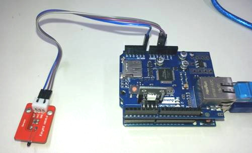
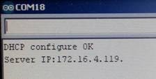
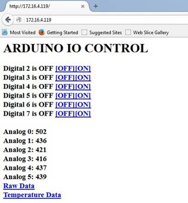

# Ethernet IO Controller

This is a fairly simple project using our [XC4412](https://jaycar.com.au/p/XC4412) Ethernet shield; It's not too hard to program but it has fairly unlimited uses. Great starting point for any IoT network or home-automation setup.

With this project, the Ethernet shield is used to serve up a web-page with info about the current state of the IO Pins, then when a user clicks on a link, they can turn the pins `ON` or `OFF`.

This works out to be a little simpler than using something like the [XC4411](https://jaycar.com.au/p/XC4411) Uno with WiFi, due to it being all controlled by the one board and using the `Ethernet.h` library bundled with the Arduino IDE, however you will have to manually `println()` each line of HTML code, so it's more for easy information without looking good. You won't be able to write up a nice webpage to send.

_Word of warning_ as this project doesn't require a password, so protection of the network will be up to you.

## Bill of Materials

| Qty | Code                                    | Description     |
| --- | --------------------------------------- | --------------- |
| 1   | [XC4410](http://jaycar.com.au/p/XC4410) | Uno main board  |
| 1   | [XC4412](http://jaycar.com.au/p/XC4412) | Ethernet shield |

### You may also need

- [YN8205 10m Ethernet Cable](https://jaycar.com.au/p/YN8205)

## Assembly

The shield simply just sits on top of the UNO, you will then be able to plug in anything except for pins `10 - 13`. Below is an image we have with an analogue sensor and an RGB light.



## Use and Source code discussion

Once uploaded, set your Serial Monitor to `115200` and reboot the arduino, you should see the IP printed out to the Serial Monitor.



Now open a browser on the network, and type the IP address into the address bar (ignore the last .):



This is the page you should get. You can control the digital outputs by clicking the `[OFF]` and `[ON]` links at the top. The default analogue display is raw data, but clicking on 'Temperature Data' will show the inputs converted to degrees.

You could do a lot more interesting things by changing the sketch. Notice how the Arduino uses query parameters to change the outputs, such as `http://172.16.4.119/?21`

This is managed by parsing the `int` from the string and managing what pin that is.

So you can add extra commands by adding extra `if` statements here. For example:

```cpp
if(parms=="debug"){
  Serial.println("Debug");
}
```

will print _Debug_ on the serial monitor if the page `http://172.16.4.119/?debug`
is accessed.

At the moment though, these commands will be hidden, because there isn't a link for them.

To add a link to the page that is served up, you need to add the following to the section that ‘prints' out the web page to the browser:

```cpp
  client.print("<a href=\"");
  client.print(fname);
  client.print("?debug\">debug</a><br>");
```

Note that the first `debug` is the name of the command used in the `if` statement above, while the second `debug` is what appears as the link on the screen.

This is a useful link if you want to understand the HTML generated by the Arduino:

[http://www.simplehtmlguide.com/cheatsheet.php](http://www.simplehtmlguide.com/cheatsheet.php)

Here is a typical sample of the HTML generated by the sketch:

```html
<h1>ARDUINO IO CONTROL</h1>
Digital 2 is ON <a href="?20">[OFF]</a><a href="?21">[ON]</a><br />
Digital 3 is OFF <a href="?30">[OFF]</a><a href="?31">[ON]</a><br />
Digital 4 is OFF <a href="?40">[OFF]</a><a href="?41">[ON]</a><br />
Digital 5 is ON <a href="?50">[OFF]</a><a href="?51">[ON]</a><br />
Digital 6 is OFF <a href="?60">[OFF]</a><a href="?61">[ON]</a><br />
Digital 7 is OFF <a href="?70">[OFF]</a><a href="?71">[ON]</a><br />
Analog 0:  516 <br />
Analog 1:  391 <br />
Analog 2:  315 <br />
Analog 3: 264 <br />
Analog 4:  227 <br />
Analog 5:  244 <br />
<a href="raw.htm">Raw Data</a> <br />
<a href="temp.htm">Temperature Data</a>
```

## Future Improvements

Of course, this project serves as a basis for your IoT and home automation networks, so you can still use other pins to connect modules to, such as relays, LEDS, and analogue sensors.

Due to the minimisation of the code running solely on the `ATmega328p` There's not a lot of room to put full html code onto (unlike the ESP8266 boards, which have 4 - 8 megabytes of flash). However, this project still has uses for Machine-to-Machine connections and interfaces, as it could become part of a much larger system.

Have a look on the issues tab for issues that we're looking to solve; namely to make the code nicer to read, and perhaps some JSON control. There are libraries out there that perform JSON parsing such as <https://github.com/bblanchon/ArduinoJson>

As long as it compiles and fits onto the UNO, we'll be happy to accept pull requests.
